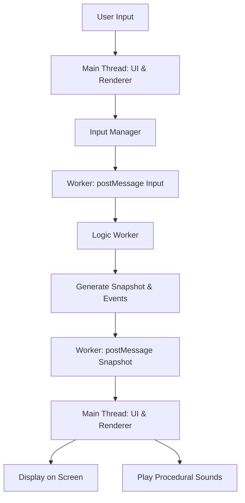

# 🎮 VibeCodeTris

> VibeCodeTris: A GENERIC BLOCK DROPPING experience where every move resonates with a unique, procedural "tone." Built with TypeScript and a worker-driven architecture, it seeks to explore the boundaries of replayability, accessibility, and dynamic audio. This project was designed and implemented in a series of iterative, conversational interactions with various "AI" LLM Agents.  

---

## 🌐 Live Demo & Repository

-   **Play the Game:** **[https://vibecodetrismvp.netlify.app/](https://vibecodetrismvp.netlify.app/)**
-   **Source Code:** **[https://github.com/skinnerboxentertainment/VibeCodeTrisMVP](https://github.com/skinnerboxentertainment/VibeCodeTrisMVP)**

---

## 🧭 Overview

**VibeCodeTris** is an experimental project aimed at implementing a well known classic falling block puzzle game. We (a few Agentic AI Bots... I guess???) crafted a modern, robust T####s engine from the ground up, emphasizing a strict separation between core game logic and presentation. This design unlocks advanced capabilities, including perfectly deterministic replays, resilient crash-recovery, and a deeply customizable, adaptive player experience.

Developed using the **"VibeCoding"** methodology, VibeCodeTris embodies a spec-first, AI-augmented iterative workflow. Every architectural decision and feature is rigorously documented and validated, leveraging advanced tools to ensure a high-quality, maintainable, and forward-thinking codebase.

---

## ✨ Features

### Core Gameplay Mechanics

-   **Deterministic Engine:** Experience unparalleled consistency. Every game is 100% reproducible from an initial seed and input log, powered by a finely-tuned, tick-based simulation and a custom Pseudo-Random Number Generator (PRNG). That said, this feature is not currently exposed to the player;
-   **Modern Tetris Ruleset:** Enjoy the familiar yet refined mechanics of the Super Rotation System (SRS) for precise piece manipulation and a 7-Bag randomizer for equitable piece distribution.
-   **Advanced Scoring System:** Engage with a unified multiplier system that richly rewards high-tempo, skilled play. Score big with bonuses for line clears, sustained combos, etc.
-   **Adjustable Timings:** Tailor the gameplay to your exact preferences with user-configurable DAS (Delayed Auto Shift) and ARR (Auto Repeat Rate) for optimal responsiveness.

### Visual & Rendering System

-   **Hardware-Accelerated Rendering:** Immerse yourself in fluid, buttery-smooth 60fps visuals, brought to life by the powerful PixiJS rendering engine.
-   **Ghost Piece:** Enhance your precision with a toggleable ghost piece, providing a clear preview of where your current piece will land.
-   **Customizable Block Styles:** Personalize your visual experience. Choose from a range of distinctive block themes, including `Modern`, `Classic`, `NES-like`, and the upcoming `Faceted Gem`.
-   **Dynamic Visual Effects:** A cutting-edge, modular "juice" system elevates every moment. Currently featuring the electrifying "Super Scanline" and nostalgic "VHS Glitch" multiplier displays as proofs of concept, with exciting plans for advanced GSAP-powered animations and a sophisticated shader-based post-processing pipeline. 

### Accessibility

-   **Colorblind-Friendly Palettes:** Play comfortably with multiple expertly designed color palettes, including presets optimized for Deuteranopia, Protanopia, and Tritanopia.
-   **High-Contrast Mode:** Opt for maximum visual clarity with a dedicated high-contrast theme.
-   **Distinct Piece Patterns:** Pieces are uniquely identifiable through distinct patterns, ensuring clear differentiation without sole reliance on color.
-   **Screen Reader Support:** Empowering accessibility for all players, key game events are announced via ARIA live regions, supporting blind and low-vision users. (Implemented, but limited)
-   **Comprehensive Control Options:** Seamlessly control the game with full support for Keyboard, Gamepad, and intuitive Touch controls (featuring virtual buttons and gestures). Custom remapping of controls is soon to be implemented in order to extend accessibility options

### Audio

-   **Fully Procedural Sound:** Experience a dynamic soundscape where all audio is generated in real-time using the versatile **Tone.js** library. Say goodbye to static, pre-recorded assets!
-   **Adaptive Music Engine (Vision):** Our evolving soundscape is designed to dynamically adapt to game intensity. Future updates will introduce layers of music and effects that evolve directly with board height, level, and player performance, creating an immersive, living soundtrack.
-   **Piece Melody System:** Transform every falling piece into a temporary musical instrument. Player actions generate dynamic melodic feedback, creating a unique auditory connection to the gameplay.

---

## 🏗️ Architecture

VibeCodeTris stands on the foundation of a worker-authoritative architecture. The entire core game logic operates within a dedicated Web Worker, guaranteeing the main UI thread remains consistently smooth and responsive. This worker acts as the single source of truth, communicating with the renderer through a stream of compact, checksum-validated state snapshots.



This meticulously decoupled design is the bedrock for the project's unparalleled determinism and resilience, paving the way for advanced features like perfect replays and robust crash recovery.

---

## 🚀 Getting Started

### Prerequisites

-   Node.js ≥ 18
-   npm or compatible package manager

### Installation

```bash
git clone https://github.com/skinnerboxentertainment/VibeCodeTrisMVP.git
cd VibeCodeTrisMVP
npm install
```

### Development

```bash
npm run dev
```

This command launches a local development server using Vite, providing a fast and efficient development experience.

### Testing

```bash
npm run test
```

Execute the comprehensive test suite with Vitest to rigorously validate the deterministic logic and integrity of the game engine.

---

### VibeCoding

I used VS Code with Gemini CLI, as well as GitHub Co-Pilot (Haiku) to build the project up from a spec to a functional offering. Additionally, all troubleshooting was iteratively addressed using Edge Co-Pilot and Developer's console error analysis. Anyone interested in adding features without knowing what they're doing could just grab the files, get a Gemini API key, install Gemini CLI for VS Code... and just ask the bots to implement the feature... 

It's pretty cool. 
---

## 📄 License

This project is released under the **MIT License**. See the `LICENSE` file for full details.

## Thank you
Assets from www.kenney.nl. 