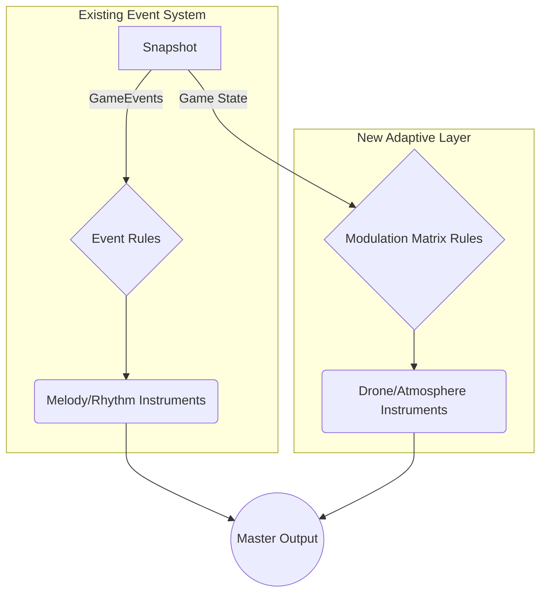

# VibeCodeTris Audio Engine Upgrade: The Adaptive State-Modulation System

## 1. Executive Summary

This document proposes a significant evolution for the VibeCodeTris audio engine. Our current system excels at providing reactive, musical feedback to discrete game events (e.g., `pieceLock`, `lineClear`). This proposal outlines the addition of a parallel, **adaptive layer** designed to create a continuous, evolving soundscape that directly reflects the player's performance and the game's tension level.

The core of this upgrade is the **Modulation Matrix**, a declarative system that maps continuous game-state variables (like board height and level) to the parameters of new, foundational synthesizer voices (a "Drone" and "Atmosphere"). This will transform the game's audio from a series of musical moments into a cohesive, immersive, and emotionally resonant journey, all while integrating cleanly into our existing `Tone.js`-based architecture.

## 2. Current System Recap

Our existing `AudioEngine` is a robust, event-driven system. It successfully ingests `Snapshot` objects from the game logic and, via a rules-based system defined in an `AudioConfig`, triggers synthesized sounds for specific events. This system serves as the perfect foundation for the proposed enhancements and will continue to function as the primary source of melodic and rhythmic feedback. The current system provides the musical "punctuation"; the new system will provide the "tone of voice."

## 3. The Proposed Evolution: An Adaptive Layer

We will introduce a new system that runs alongside the current event-handler. In every `handleSnapshot` call, this new layer will analyze the overall game state—not just the discrete events—and modulate a set of continuous background sounds. This creates an "audio texture" that directly represents the game's current state of tension, progress, and complexity.

## 4. The Core Component: The Modulation Matrix

The heart of this upgrade is the **Modulation Matrix**, a powerful, data-driven system for creating rich, adaptive soundscapes. It is not a piece of hardware, but a new section in our `AudioConfig` that defines clear relationships between game state and sound parameters.

### 4.1. Modulation Sources (Inputs from the `Snapshot`)

The Matrix will continuously monitor key VibeCodeTris state variables, such as:

*   **`level`:** The player's current level.
*   **`complexity`:** Our existing metric for board density/danger.
*   **`maxBoardHeight`:** The height of the highest-piled column.
*   **`lines`:** Total lines cleared.
*   **`score`:** The player's rolling score.

### 4.2. Modulation Targets (Outputs to `Tone.js` Instruments)

These sources will be mapped to specific parameters on our `Tone.js` synthesizer instruments:

*   **Timbre:** `filter.frequency` (brightness), `envelope.attack` (sharpness).
*   **Pitch:** `detune` (tension), `frequency` (subtle pitch shifts).
*   **Space:** `reverb.wet` (ambience/etherealness).
*   **Volume:** The `volume` of a specific instrument bus.

### 4.3. Use Case Example:

Imagine a rule that states: *"As `maxBoardHeight` increases, the filter cutoff frequency of the Atmosphere synth also increases."*

This creates a direct, intuitive feedback loop: as the player gets closer to topping out, a background "wind" or "hiss" grows brighter and more intense, audibly communicating the rising danger without a single discrete sound effect.

## 5. Concrete Implementation: The Foundational Voices

To utilize the Modulation Matrix, we will introduce two new, always-on instrument voices defined within our `AudioConfig`.

*   **Drone (The Foundation):** A continuous, low-frequency bass texture generated by two slightly detuned `Tone.FMSynth`s. This represents the underlying "mood" of the game.
    *   **Modulation Example:** The `level` acts as a source. As the `level` increases, the `detune` amount between the two oscillators increases, making the drone feel more tense and unstable.

*   **Atmosphere (The Environment):** A shaped noise texture using a `Tone.NoiseSynth` passed through a resonant filter. This represents the game's tension and complexity.
    *   **Modulation Example:** The `complexity` metric directly controls the `filter.frequency`. At low complexity, the sound is a muted, low rumble. As the board fills, the filter opens, transforming the sound into a brighter, more urgent hiss.

## 6. Architectural Integration & Data Flow

This system is designed as a clean addition to our existing architecture.

1.  **`types.ts`:** We will define a new `ModulationRuleConfig` interface and add an array of these rules to our main `AudioConfig`.

    ```typescript
    // In src/audio/types.ts
    export interface ModulationRuleConfig {
      source: 'level' | 'complexity' | 'maxBoardHeight' | 'lines' | 'score';
      target: {
        instrumentName: string; // e.g., 'Atmosphere'
        parameter: string;     // e.g., 'filter.frequency'
      };
      // Defines how the source value is mapped to the target range
      transferFunction: {
        inputRange: [number, number];
        outputRange: [number, number];
      };
    }

    export interface AudioConfig {
      // ... existing properties
      modulations?: ModulationRuleConfig[];
    }
    ```

2.  **`AudioEngine.ts`:** In the `handleSnapshot` method, after the main event loop, we will add a new loop that iterates through `audioConfig.modulations`. For each rule, it will:
    a. Read the value from the `Snapshot` (e.g., `snapshot.stats.level`).
    b. Apply the transfer function to map it to the target output range.
    c. Update the corresponding `Tone.js` instrument parameter directly.

### New Data Flow Diagram



## 7. Benefits

*   **Emotional Arc:** Creates a dynamic sonic narrative that mirrors the player's journey—building tension, creating moments of calm, and celebrating progress.
*   **Deeper Immersion:** Fills the sonic space, making the game world feel more persistent and alive.
*   **Enhanced Player Feedback:** Provides subtle, continuous, and subconscious cues about the game state, allowing players to "feel" their performance.
*   **Future-Proofing:** The Modulation Matrix is an extensible framework. Once built, adding new adaptive behaviors or new voices becomes a simple matter of updating the `AudioConfig` JSON, with no further code changes required.