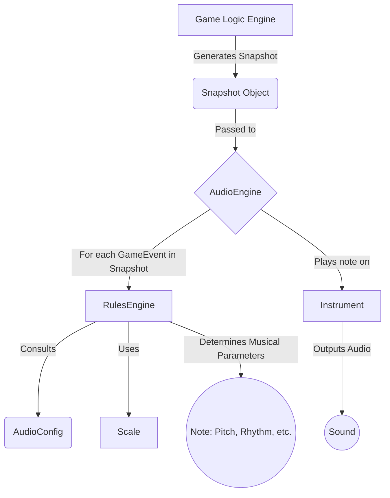

# VibeCodeTris Audio System: A Comprehensive Overview

## 1. Executive Summary

The VibeCodeTris audio system is a fully procedural, event-driven music engine designed to create a deeply reactive and synesthetic gameplay experience. Unlike traditional systems that trigger static audio files, this engine functions as a real-time generative synthesizer. It translates gameplay actions and game state directly into musical expressions, ensuring the audio is always perfectly synchronized with and reflective of the player's journey. The entire system is built upon the Web Audio API, primarily utilizing the **Tone.js** library to manage synthesis, scheduling, and effects.

## 2. Core Philosophy: Audio as a Reflection of State

The foundational principle is that the audio should not merely accompany the gameplay but be an integral part of it. Every sound is a direct auditory representation of a specific game mechanic or state change. This approach eliminates the need for any pre-recorded assets, resulting in zero audio load times, infinite variation, and a soundscape that evolves dynamically with the game's intensity and the player's performance.

## 3. Architectural Breakdown

The architecture is decoupled from the core game logic, receiving state information passively. It is composed of several key modules working in concert:

### 3.1. `AudioEngine` (`src/audio/AudioEngine.ts`)

This is the central nervous system of the audio system. It is a singleton class responsible for:
*   **Lifecycle Management:** Initializing and starting the audio context (`Tone.js`).
*   **Master Bus:** Controlling the global volume and master effects chain.
*   **State Ingestion:** Receiving `Snapshot` objects from the game logic via its primary public method, `handleSnapshot()`.
*   **Orchestration:** Passing game events and state data to the appropriate internal components (`RulesEngine`, `Instrument` pools).
*   **Dynamic Intensity:** Calculating a "complexity" metric from the game state (level, board height) to dynamically adjust the master volume, making the mix quieter during simple moments and more intense as the difficulty ramps up.

### 3.2. `RulesEngine` (Internal to `AudioEngine.ts`)

This is the decision-making core of the engine. For every game event (e.g., `pieceLock`, `lineClear`) received from the `Snapshot`, the `RulesEngine` consults the active `AudioConfig` to determine what musical action to take. Its responsibilities include:
*   **Event-to-Action Mapping:** Matching incoming `GameEvent` types to specific rules defined in the configuration.
*   **Parameter Derivation:** Calculating musical parameters (pitch, rhythm, duration, velocity) based on the rule's definition and the current game state. For example, a rule might specify that the pitch of a sound is determined by the `pieceType` that was just locked.
*   **Musicality Enforcement:** Collaborating with the `Scale` object to ensure all resulting notes are harmonically pleasing and within the desired musical key.

### 3.3. `Instrument` (Internal to `AudioEngine.ts`)

This class acts as a voice manager for a pool of `Tone.js` synthesizers.
*   **Voice Pooling:** Manages a collection of synthesizers to handle polyphony, preventing notes from cutting each other off.
*   **Sound Design:** Each `Instrument` instance is configured with a specific synthesizer type (e.g., `FMSynth`, `AMSynth`) and effects chain (e.g., Reverb, Delay) as defined in the `AudioConfig`.
*   **Playback:** Exposes a simple `.play()` method that the `AudioEngine` calls with the parameters determined by the `RulesEngine`.

### 3.4. `Scale` (Internal to `AudioEngine.ts`)

This is a simple but crucial utility that ensures the generated music is always harmonious.
*   **Key & Mode:** It is initialized with a musical key (e.g., "C") and a mode (e.g., "dorian").
*   **Note Quantization:** It provides a method that takes a numerical input (e.g., a piece index, a row number) and returns a valid musical note within the defined scale. This is the key to translating arbitrary game data into melody.

## 4. Data Flow and Interrelationships

The flow of information is unidirectional, from the game logic to the audio engine.

1.  **Game Logic:** The main game loop (`engine.ts`) produces a `Snapshot` object on every game tick or state change. This snapshot contains the complete current game state and a list of discrete `GameEvent`s that occurred since the last snapshot.
2.  **`AudioEngine.handleSnapshot()`:** The `Snapshot` is passed to the `AudioEngine`.
3.  **Event Iteration:** The engine iterates through the `events` array in the snapshot.
4.  **Rule Processing:** For each event, the `RulesEngine` finds a matching rule in the `AudioConfig`.
5.  **Musical Parameter Calculation:** The `RulesEngine` uses the rule's logic and the snapshot's state data to calculate the final note parameters. This often involves using the `Scale` object for pitch.
6.  **Sound Generation:** The `AudioEngine` directs the appropriate `Instrument` to play the note with the calculated parameters.

## 5. System Inputs (Modulation Sources)

The audio is influenced by a wide range of game state variables:

*   **Discrete Events:** The primary driver. Includes `pieceSpawn`, `pieceMove`, `pieceRotate`, `pieceLock`, `lineClear`, `levelUp`, `gameOver`.
*   **Piece State:** The type of the current piece (`pieceType` as an index `0-6`), its orientation, and its position.
*   **Board State:** The height of each column, the total number of filled cells.
*   **Score & Level:** The player's current score, level, and line count.
*   **Game Phase:** The current state of the game (e.g., `playing`, `paused`, `gameOver`).

## 6. System Outputs (Musical Parameters)

The inputs are mapped to fundamental musical properties:

*   **Pitch:** The musical note of a sound. Often determined by `pieceType` or the vertical position of an event.
*   **Rhythm & Duration:** The timing and length of a note. Often linked to game tempo or specific events like line clears.
*   **Velocity (Volume):** The loudness of a single note. Can be used to add emphasis.
*   **Timbre:** The quality of the sound itself, determined by which `Instrument` (synthesizer configuration) is triggered.
*   **Harmony:** The combination of notes over time, governed by the active `Scale`.
*   **Master Volume/Complexity:** The overall loudness of the mix, dynamically adjusted based on game intensity.

## 7. The `AudioConfig` Contract (`src/audio/types.ts`)

This is the schema that defines a complete "sound pack" for the game. A different configuration file can be loaded to completely change the game's audio without touching the engine's code. It defines:
*   The master tempo and musical key/scale.
*   A list of `Instrument` configurations.
*   A comprehensive list of `EventRuleConfig`s that explicitly link game events to instruments and define the logic for deriving musical parameters from the game state.

This declarative, configuration-driven approach makes the audio system exceptionally flexible, customizable, and easy to iterate on.